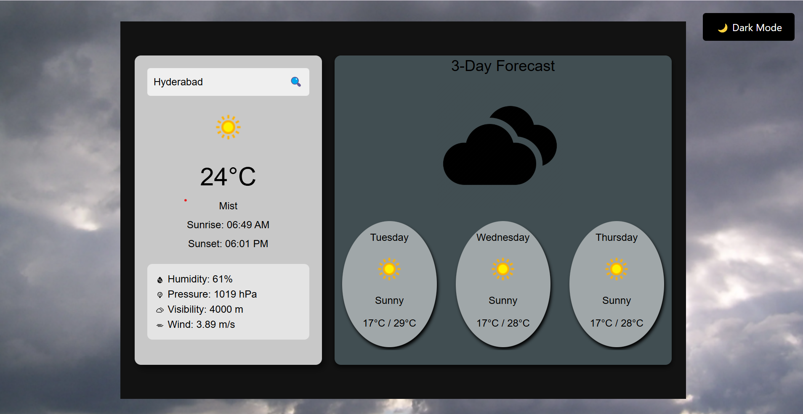
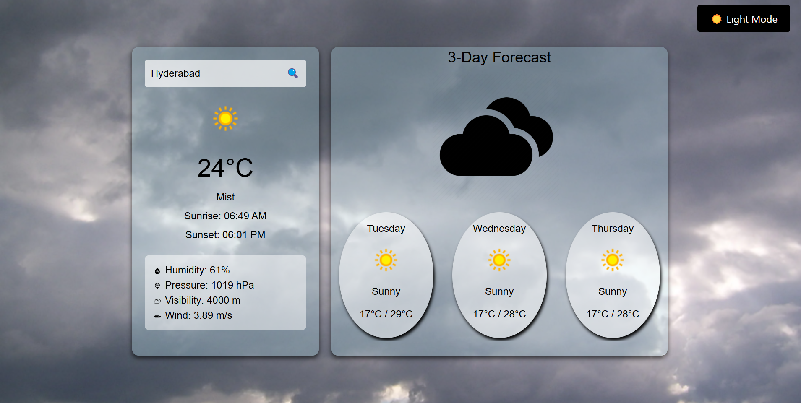

# Weather-App (Laptop View)

## Overview

The WeatherCard component is a React-based weather application that fetches real-time weather data using the WeatherAPI. It provides current weather details, including temperature, condition, humidity, wind speed, and a 3-day weather forecast.

## Features

- Search for a city's weather.
- Displays current weather conditions.
- Shows sunrise and sunset times.
- Displays additional weather details such as humidity, pressure, visibility, and wind speed.
- Provides a 3-day weather forecast with min/max temperatures and conditions.

## Technologies Used

- **React** (useState, useEffect for state management and API calls)
- **Axios** (for fetching weather data)
- **WeatherAPI** (for real-time weather(climate) information)
- **React Icons** (for weather-related icons)
- **CSS** (for styling)

## Screen Shots

